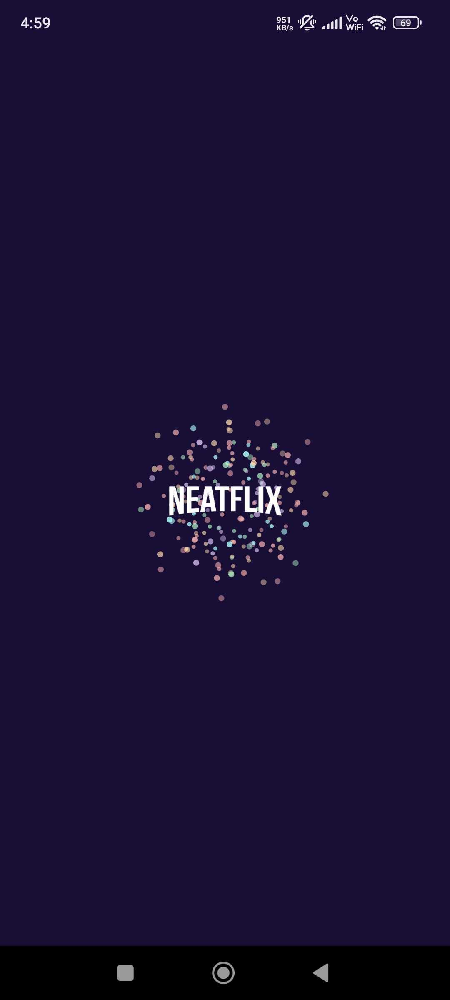
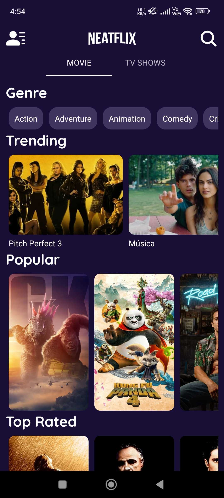
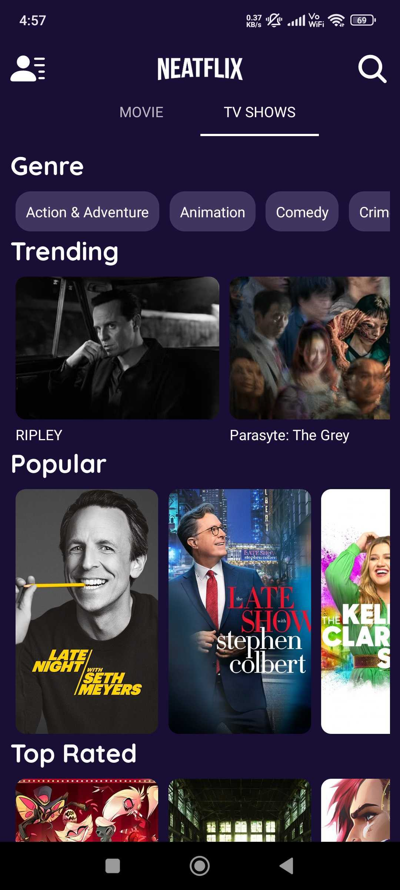

# pixeltrue

# NETFLIX

App built using Flutter that consumes [TMDB API](https://developers.themoviedb.org/3/getting-started/introduction) to display the current trending, upcoming, top rated, and popular movies and tv-shows. It also suggests films based on your watch list.

---
# Setup Requirements
### Prerequisites

Obtain your API key from [TMDB](https://developers.themoviedb.org/3/getting-started/introduction) and add it in a file named `.env` within the root directory:

NEATFLIX_API_KEY="****"

---

---
# Screenshots

  

Happy coding!

A few resources to get you started if this is your first Flutter project:

- [Lab: Write your first Flutter app](https://docs.flutter.dev/get-started/codelab)
- [Cookbook: Useful Flutter samples](https://docs.flutter.dev/cookbook)

For help getting started with Flutter development, view the
[online documentation](https://docs.flutter.dev/), which offers tutorials,
samples, guidance on mobile development, and a full API reference.
